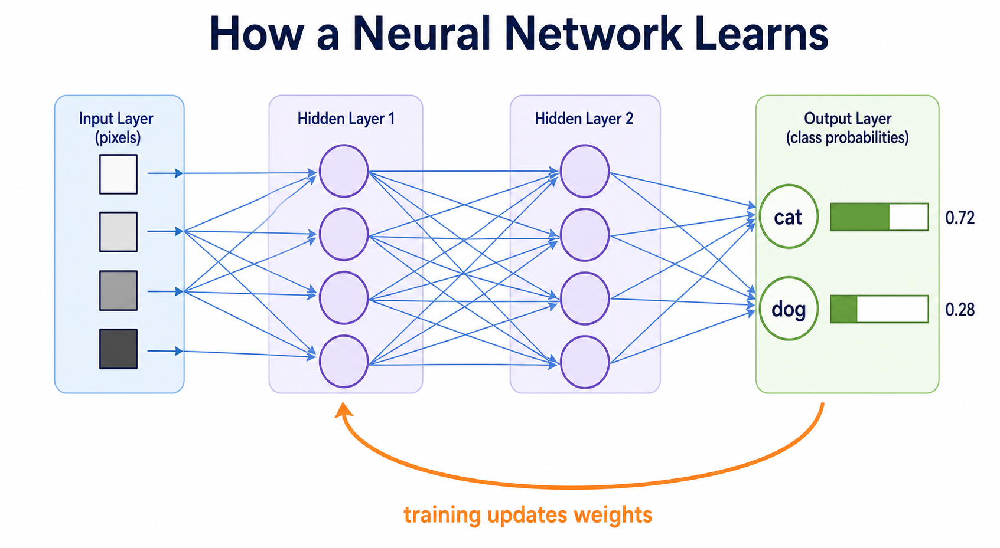

# How Do Neural Networks Learn?

A neural network is a machine-learning model made from connected layers of small calculations. It learns by adjusting many numerical values, called **weights**, so that its predictions become less wrong on training examples.

Neural networks are useful when patterns are too complex for a simple hand-written rule or a basic linear model: recognizing objects in images, transcribing speech, translating languages, and predicting the next token in a language model.

```text
Input data → layers of calculations → prediction
                    ↑
          training improves the weights
```

## The Core Idea

Consider an image classifier that decides whether a small image contains a cat or a dog. The image is represented as numbers, such as pixel values. A neural network combines those numbers through several layers to produce a prediction.

```text
Image pixels → hidden layers find patterns → output: cat or dog probability
```

At first, the network's weights are usually random, so its predictions are poor. Training repeats the following cycle across many labeled examples:

```text
1. Make a prediction
2. Measure how wrong it is
3. Find which weights contributed to the error
4. Adjust those weights slightly
5. Repeat
```

## Neural Network Building Blocks

| Component | What it does | Example |
|---|---|---|
| **Input layer** | Receives input features. | Pixel values from an image. |
| **Weight** | Controls how strongly one value affects the next calculation. | A connection that makes a dark edge more important. |
| **Bias** | Shifts a calculation up or down. | Lets a node activate even when inputs are small. |
| **Node** | Combines inputs, weights, and a bias. | Detects a simple pattern such as an edge. |
| **Activation function** | Transforms a node’s result. | Keeps useful signals and adds nonlinearity. |
| **Hidden layer** | Learns intermediate patterns. | Combines edges into shapes, then shapes into objects. |
| **Output layer** | Produces the final prediction. | Probability that the image contains a cat. |
| **Loss function** | Measures prediction error during training. | Penalizes a confident incorrect prediction. |

## Layers: From Simple Patterns to Useful Outputs

A network has an input layer, one or more hidden layers, and an output layer.

```text
Input layer          Hidden layers                     Output layer
image pixels    →    edges → shapes → object parts  →  cat: 0.91
                                                        dog: 0.09
```

This picture is an intuition, not a rule that every node has a human-readable meaning. A network learns numerical representations that are useful for the task. In a deep network, later layers often combine simpler patterns from earlier layers into more complex ones.



## A Node Is a Small Mathematical Calculation

Each node starts by calculating a weighted sum, then usually applies an activation function:

```text
weighted sum = (input₁ × weight₁) + (input₂ × weight₂) + bias
output = activation(weighted sum)
```

### Example: A Simplified Node

Assume two image features are supplied to one node:

```text
inputs:  [0.8, 0.2]
weights: [0.5, -0.4]
bias:    0.1
```

The weighted sum is:

```text
(0.8 × 0.5) + (0.2 × -0.4) + 0.1
= 0.4 - 0.08 + 0.1
= 0.42
```

The result, `0.42`, is passed to an activation function. A real neural network contains many nodes and often millions or billions of weights, but it repeats this same basic calculation.

## Activation Functions: Learning Nonlinear Patterns

Without activation functions, multiple layers would behave like one large linear calculation. Activation functions make it possible to learn more complex, nonlinear relationships.

### Example: ReLU

The **ReLU** activation function is common in hidden layers:

```text
ReLU(x) = 0 when x is negative
ReLU(x) = x when x is positive
```

```text
ReLU(0.42)  = 0.42
ReLU(-0.30) = 0
```

This means the simplified node above sends `0.42` to the next layer. A negative signal would be turned into `0`.

Other activation functions serve different purposes. For example, a **sigmoid** function can turn a final score into a value between `0` and `1`, while **softmax** converts several output scores into probabilities that add up to `1`.

## The Forward Pass: Making a Prediction

The **forward pass** is the journey from input to output. Values move forward through the network's layers using the current weights.

### Example: Cat or Dog Prediction

```text
Input image
    ↓
Layer 1: detects simple visual patterns
    ↓
Layer 2: combines patterns into shapes
    ↓
Output layer: cat = 0.30, dog = 0.70
```

The model currently predicts **dog** because `0.70` is the higher probability. During training, the correct label tells the model whether that prediction was good or bad.

## Loss: Measuring How Wrong a Prediction Is

The network needs a number that describes how well its output matches the correct answer. This number is the **loss**.

```text
prediction + correct label → loss function → error value
```

### Example: A Confident Wrong Prediction

Suppose the image is really a cat:

```text
correct label: cat
model prediction: cat = 0.30, dog = 0.70
```

The loss is relatively high because the model gave a high probability to the wrong class. A prediction of `cat = 0.49, dog = 0.51` would still be wrong, but it would usually receive a smaller penalty because it was less confident.

The exact loss calculation depends on the task. Classification often uses cross-entropy loss; predicting a number such as a house price often uses a form of distance between the prediction and actual value.

## Backpropagation: Finding What to Change

**Backpropagation** is the training method that sends information about the error backward through the network. It calculates how much each weight contributed to the loss.

```text
forward pass:  input → layers → prediction → loss
backward pass: loss → layers → contribution of each weight to the error
```

Backpropagation uses calculus to compute **gradients**. A gradient indicates how a small change to a weight would change the loss.

### Example: Weight Direction

For a particular weight, backpropagation might indicate:

```text
Increasing this weight would increase the loss.
Therefore, decrease it slightly.
```

For another weight:

```text
Increasing this weight would reduce the loss.
Therefore, increase it slightly.
```

Backpropagation does not set a perfect weight in one step. It provides the direction and size of many small improvements.

## Gradient Descent: Updating the Weights

An optimizer uses gradients to update the weights. The general idea is **gradient descent**:

```text
new weight = old weight − learning rate × gradient
```

The **learning rate** controls the step size.

### Example: A Small Weight Update

```text
old weight:    0.50
gradient:      0.20
learning rate: 0.10

new weight = 0.50 − (0.10 × 0.20)
           = 0.48
```

The weight changes from `0.50` to `0.48`. Training makes many such small updates across all weights and many examples.

If the learning rate is too large, training can jump past good solutions. If it is too small, learning can be very slow. Choosing it is one of several training decisions called **hyperparameters**.

## Training Happens in Repeated Rounds

An **epoch** is one full pass through the training data. Large datasets are usually processed in smaller groups called **batches**.

```text
Training data
    ↓
Batch 1 → prediction → loss → backpropagation → weight update
Batch 2 → prediction → loss → backpropagation → weight update
...
One pass through all batches = one epoch
```

Training continues for multiple epochs while the team monitors loss and performance on validation data.

## A Complete Simplified Learning Cycle

```text
1. Input: an image labelled “cat”
2. Forward pass: the network predicts cat = 0.30, dog = 0.70
3. Loss: the confident dog prediction receives a high penalty
4. Backpropagation: calculate each weight’s contribution to that error
5. Optimizer: update the weights slightly
6. Next pass: the network becomes a little more likely to predict cat for similar examples
7. Repeat with many diverse images
```

Over time, the network learns weights that reduce error across the training data. It must then be tested on images it has never seen to check whether it learned a general pattern rather than memorizing examples.

## Why Neural Networks Are Powerful

Neural networks can automatically learn combinations of features that would be difficult to define by hand.

| Data type | Possible learned patterns | Example application |
|---|---|---|
| Images | Edges, shapes, objects. | Detecting defects in manufactured products. |
| Audio | Frequencies, sounds, spoken words. | Speech recognition. |
| Text | Word relationships and context. | Translation or question answering. |
| Time series | Trends and repeated sequences. | Forecasting energy demand. |

They still depend on suitable data, clear objectives, careful evaluation, and appropriate safeguards. A neural network can make confident but incorrect predictions.

## Common Challenges

| Challenge | What it means | Typical response |
|---|---|---|
| **Overfitting** | The network memorizes training details but fails on new data. | Use more diverse data, regularization, and validation. |
| **Underfitting** | The network is too simple or insufficiently trained. | Improve features, architecture, or training. |
| **Biased data** | Training examples do not represent the intended population fairly. | Audit data and evaluate across relevant groups. |
| **High compute cost** | Large networks can require substantial hardware and energy. | Choose an appropriate model size and reuse pretrained models when suitable. |
| **Limited interpretability** | It can be hard to explain every internal calculation. | Combine testing, monitoring, documentation, and human oversight. |

## Key Takeaways

- Neural networks are layers of weighted calculations that learn patterns from examples.
- A node combines inputs, weights, and a bias, then applies an activation function.
- The forward pass produces a prediction; the loss function measures its error.
- Backpropagation calculates how each weight contributed to the loss.
- Gradient descent updates weights through many small steps.
- Good training performance is not enough: evaluate on unseen data and consider data quality, bias, cost, and safety.

## References

- [Google Machine Learning Crash Course: Neural Networks](https://developers.google.com/machine-learning/crash-course/neural-networks) — free interactive lessons on nodes, hidden layers, activations, and backpropagation.
- [Goodfellow, Bengio, and Courville, *Deep Learning*](https://www.deeplearningbook.org/) — a free online textbook covering deep feedforward networks, regularization, and optimization.
- [3Blue1Brown neural-network lessons](https://www.3blue1brown.com/?topic=neural-networks) — visual explanations of neural-network concepts.
