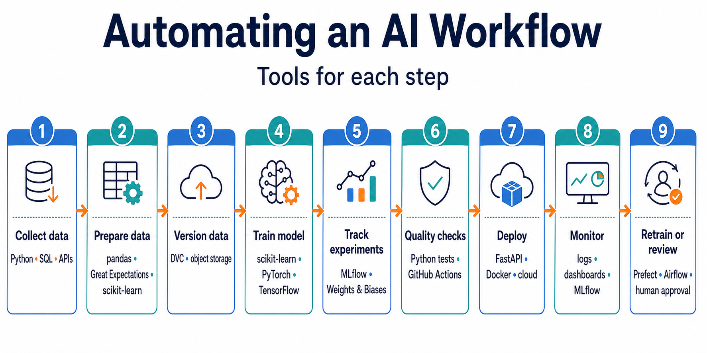

# What Tools Do We Use to Build AI?

Building AI is not only about choosing a model. You also need tools to write code, manage dependencies, explore data, train or call models, track changes, test results, and run the finished application.

You do not need every tool on day one. Start with a small, reliable setup and add tools as your projects become more complex.

```text
Idea → code and data → model → evaluation → application → deployment and monitoring
```

## The AI Builder’s Toolbox

| Tool category | Why it matters | Beginner examples |
|---|---|---|
| **Programming language** | Defines the application and data-processing logic. | Python, JavaScript/TypeScript. |
| **Data tools** | Read, clean, transform, and visualize data. | pandas, NumPy, SQL, matplotlib. |
| **ML framework** | Builds, trains, or evaluates machine-learning models. | scikit-learn, PyTorch, TensorFlow. |
| **Deployment tools** | Makes an AI application available to users. | FastAPI, Docker, cloud platforms. |

## A Practical Beginner Setup

For the Foundations lessons, focus on the tools closest to the AI workflow:

```text
Python + data tools + ML framework + deployment tools
```

This is enough to prepare data, build a model, and turn it into an application.

### Example: A Small AI Project

```text
my-ai-project/
├── data/               # project data
├── app.py              # application code
├── model/              # trained model or model configuration
├── README.md           # instructions and explanation
└── deploy/             # deployment configuration, when needed
```

The exact folders change from project to project, but this structure keeps data, model use, evaluation, and application code separate.

## 1. Programming Languages

Programming languages tell the computer how to prepare data, call a model, process a response, and build an application interface.

### Python

Python is a common starting point for AI because it has a large ecosystem for data science, machine learning, automation, and web applications.

```text
Python code → data or model library → result
```

Common Python libraries include:

| Library | Typical use |
|---|---|
| **NumPy** | Arrays and numerical calculations. |
| **pandas** | Tables, CSV files, and data cleaning. |
| **matplotlib** | Charts and visualizations. |
| **scikit-learn** | Classical machine-learning models and evaluation. |
| **PyTorch** | Neural networks and deep learning. |
| **Transformers** | Using many pretrained language, image, and audio models. |

## 2. Data Tools

AI systems depend on data. Data tools help you inspect, clean, transform, store, and visualize it.

### Example: Customer-Order Data

```text
CSV file → pandas table → clean missing values → calculate features → model input
```

| Tool | Typical job |
|---|---|
| **CSV/JSON files** | Store small, simple datasets. |
| **pandas** | Read tables, filter rows, clean columns, and summarize data. |
| **NumPy** | Work efficiently with numerical arrays. |
| **SQL** | Query data stored in relational databases. |
| **matplotlib or seaborn** | Visualize distributions, trends, and errors. |

Use the smallest data tool that fits the problem. A CSV file is enough for many learning projects; larger applications may need a database, data pipeline, and access controls.

## 3. Machine-Learning and Deep-Learning Frameworks

Frameworks provide reusable implementations of model algorithms and training tools.

| Framework | Best starting use |
|---|---|
| **scikit-learn** | Regression, classification, clustering, preprocessing, and evaluation for structured data. |
| **PyTorch** | Building and training neural networks; research and production work. |
| **TensorFlow/Keras** | Building and training neural networks with a high-level API. |
| **Transformers** | Loading and using many pretrained transformer models. |

### Example: Choose a Framework

```text
Predict house prices from spreadsheet columns → scikit-learn
Train an image-recognition neural network → PyTorch or TensorFlow
Run a pretrained language model → Transformers or a model-serving tool
```

Do not choose a complex framework merely because it is popular. Start with the simplest tool that can solve the problem and evaluate whether it works.

## 4. Deployment and Operations Tools

After a local program works, deployment tools package it and make it available to users.

```text
Local code → web API or user interface → deployment platform → users
```

| Tool or concept | Purpose |
|---|---|
| **FastAPI or Flask** | Build a Python web API around an AI application. |
| **Docker** | Package an application and its dependencies consistently. |
| **Cloud platform** | Run the application, store data, and scale resources. |
| **Environment variables** | Supply configuration and secrets without putting them in source code. |
| **Logging and monitoring** | Track errors, usage, latency, cost, and quality. |

### Example: Keep an API Key Out of Code

```text
Wrong:  api_key = "secret-key" inside app.py
Right:  API key stored in an environment variable or secret manager
```

This protects secrets from accidental sharing in Git or screenshots.

## An End-to-End Beginner Workflow

As a project grows, automate repeated, predictable work. Automation makes the workflow reproducible: the same data preparation, training, checks, and deployment steps run in the same order every time.

```text
New or changed data
        ↓
Prepare data → train model → record results → deploy → monitor
        ↑                                            ↓
        └──────────── improve from evidence ────────┘
```

### What to Automate at Each Step

```text
Collect → Prepare → Version → Train → Track → Check → Deploy → Monitor → Retrain
```

| Step | What to automate | Tool or framework for this step |
|---|---|---|
| **1. Collect data** | Fetch new files, database records, or events on a schedule. | Python scripts, SQL, APIs, Prefect, Airflow. |
| **2. Validate and prepare data** | Check schema, missing values, duplicates, and transformations. | pandas, Great Expectations, scikit-learn `Pipeline`. |
| **3. Version data** | Store the exact dataset reference used for every training run. | DVC, object storage, database snapshots. |
| **4. Train a model** | Start training with fixed code, settings, and approved data. | scikit-learn, PyTorch, TensorFlow; Prefect or Airflow to schedule it. |
| **5. Track experiments** | Save parameters, metrics, artifacts, and run details. | MLflow, Weights & Biases, structured logs. |
| **6. Apply quality gates** | Compare metrics with release requirements. | scikit-learn metrics, Python tests, GitHub Actions. |
| **7. Package and deploy** | Build and release an approved application version. | FastAPI, Docker, GitHub Actions, cloud deployment tools. |
| **8. Monitor production** | Track errors, latency, input changes, and model outcomes. | Application logs, dashboards, MLflow, cloud monitoring. |
| **9. Retrain or review** | Start a new workflow when schedules, data changes, or alerts require it. | Prefect schedules, Airflow schedules, GitHub Actions, human approval. |



### The Role of Workflow Orchestration

For a very small project, one Python script may be enough:

```text
prepare_data.py → train_model.py → evaluate_model.py
```

When a workflow has schedules, dependencies, retries, long-running jobs, or multiple systems, use an **orchestrator**. Tools such as Prefect and Airflow can schedule tasks, record their status, retry failures, and show where a workflow stopped.

```text
Scheduled workflow
    ↓
data task → training task → quality-check task → deployment task
    ↓              ↓                ↓                   ↓
 status           metrics          approval            release
```

### Keep Humans in the Loop

Automation should not remove accountability. Use a human approval step when:

- a new model will affect customers or important decisions;
- performance is close to a release threshold;
- data changes significantly;
- the workflow handles sensitive information; or
- a production alert indicates unexpected behavior.

The goal is not to automate every decision. It is to automate repeatable work while keeping people responsible for high-impact choices.

## Key Takeaways

- AI development uses a toolkit, not one single program or model.
- Data tools, ML frameworks, and model runtimes should match the problem you are solving.
- Keep secrets and local environment folders out of Git.
- Deployment and monitoring help turn a local model into a dependable AI application.

## References

- [scikit-learn: Getting Started](https://scikit-learn.org/stable/getting_started.html) — official introduction to data preprocessing, model fitting, evaluation, and pipelines.
- [PyTorch Tutorials](https://docs.pytorch.org/tutorials/) — official learning resources for neural networks and deep learning.
- [Hugging Face documentation](https://huggingface.co/docs) — documentation for open models, datasets, and machine-learning libraries.
- [FastAPI documentation](https://fastapi.tiangolo.com/) — official guide to building Python web APIs.
- [Prefect documentation](https://docs.prefect.io/v3/get-started) — workflow orchestration for Python data and ML pipelines.
- [GitHub Actions documentation](https://docs.github.com/en/actions) — automation for continuous integration, deployment, and scheduled workflows.
- [DVC documentation](https://doc.dvc.org/start) — data versioning for reproducible machine-learning projects.
- [MLflow Tracking](https://mlflow.org/docs/latest/ml/tracking/) — experiment and model-run tracking.
