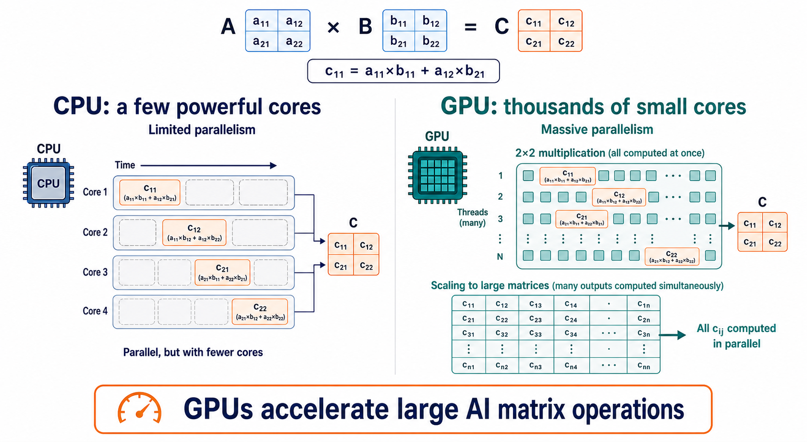

# How Do GPUs Accelerate AI?

A **Graphics Processing Unit (GPU)** is a processor designed to perform many similar calculations at the same time. This makes GPUs especially effective for modern AI, where models repeatedly perform large mathematical operations on arrays of numbers.

```text
Training data → GPU performs parallel calculations → model updates → trained model
```

## Why Do AI Systems Need So Much Processing?

Deep-learning models learn by repeating mathematical operations many times. For one training step, a model may need to:

1. multiply large matrices of numbers;
2. compare a prediction with the expected answer;
3. calculate an error; and
4. update millions or billions of model weights.

```text
Input values → matrix operations → prediction → error → updated weights
```

The same operations are often applied to many values at once. This is where a GPU is useful.

## How a GPU Helps AI

A CPU is optimized for flexible, sequential work such as application logic, data preparation, and system coordination. A GPU is optimized for high-throughput parallel work: it can run thousands of lightweight operations together.

| Processor | Main strength | Typical AI role |
|---|---|---|
| **CPU** | Flexible, fast sequential work and coordination. | Runs the application, prepares data, manages requests, and coordinates other hardware. |
| **GPU** | Large numbers of similar calculations in parallel. | Trains neural networks and runs large-scale inference. |

NVIDIA describes GPUs as processors designed to execute thousands of threads in parallel, while CPUs emphasize fast execution of a smaller number of sequential threads. [NVIDIA CUDA Programming Guide](https://docs.nvidia.com/cuda/cuda-programming-guide/01-introduction/introduction.html)



## Matrix Operations: The Core Reason GPUs Help

AI models represent data and model weights as arrays, often called **tensors**. A common operation is matrix multiplication.

```text
Input data matrix  ×  model-weight matrix  =  model output matrix
```

Each number in the output can often be calculated independently. A GPU can divide this work among many processing units.

```text
Large matrix multiplication
        ↓
split into many small calculations
        ↓
GPU processing units work in parallel
        ↓
combined output
```

This pattern appears in image recognition, language models, recommendation systems, speech recognition, and generative AI.

## GPU Programmability

A GPU is useful for AI only when software can send work to it. Developers do this by defining or using **kernels**: programs that run many times in parallel on GPU processing units.

```text
Python AI application
        ↓
Machine-learning framework
        ↓
GPU library or kernel
        ↓
GPU performs parallel calculations
```

Most AI developers do not write low-level GPU kernels for every model. Frameworks such as PyTorch, TensorFlow, and JAX can automatically use GPU-accelerated operations for common tasks such as matrix multiplication, neural-network layers, and gradient calculations.

| Level | Example | What the developer does |
|---|---|---|
| **High level** | PyTorch, TensorFlow, JAX | Builds and trains a model; the framework sends supported operations to the GPU. |
| **Library level** | cuBLAS, cuDNN, ROCm libraries | Uses optimized mathematical and deep-learning operations. |
| **Kernel level** | CUDA, HIP, Triton | Writes or customizes code that runs in parallel on the GPU. |

GPU programmability is important because hardware alone does not accelerate an application. The model, framework, drivers, and GPU libraries must work together to place suitable operations on the GPU.

### Using a GPU Through a Framework

For many AI projects, GPU use is abstracted away. The developer selects an available device, then the framework sends supported model operations to the GPU.

```python
device = "cuda"  # Use a compatible NVIDIA GPU.
model.to(device)
```

You usually do **not** need to write CUDA kernels yourself. The framework and its optimized libraries handle common operations such as matrix multiplication, neural-network layers, and gradient calculations. You still need a compatible GPU, driver, and framework installation.

## Training with a GPU

Training is the process of adjusting a model's weights using many examples. GPU acceleration is especially important because training repeats the same large calculations over and over.

```text
Training batch
        ↓
GPU calculates prediction
        ↓
GPU calculates error and gradients
        ↓
GPU updates model weights
        ↓
repeat for many batches and training rounds
```

Without GPU acceleration, training a large neural network can take much longer or require many more CPU servers.

## GPU Inference

**Inference** means using a trained model to produce an answer, classification, or generated output.

```text
User prompt or data
        ↓
GPU runs the trained model
        ↓
Prediction or generated response
```

GPUs help inference when a model is large, when many users need responses at once, or when low response time is important. Smaller models and low-volume applications can still run effectively on CPUs.

## GPU Memory Matters

The GPU needs enough dedicated memory, often called **VRAM**, to hold the model, its input data, and intermediate calculations.

```text
GPU memory (VRAM)
├── model weights
├── input data or prompt tokens
├── intermediate calculations
└── generated output and temporary data
```

If a model does not fit in GPU memory, it may fail to run, run more slowly by moving data between devices, or require techniques such as model quantization, offloading, or multiple GPUs.

## GPU Vendors and Hardware Ranges

The AI-GPU market changes quickly. The table below is a **July 2026 snapshot** of representative hardware ranges from major vendors. It is intended to show the scale of available hardware, not to recommend a particular GPU.

| Vendor | Parallel compute units | Memory capacity range | Peak memory-bandwidth range | Important AI hardware capabilities |
|---|---|---|---|---|
| **NVIDIA** | Up to **24,064 CUDA cores** in a current professional GPU; data-center GPUs also use Tensor Cores | **96–180 GB** | about **1.6–8 TB/s** | Tensor Cores; high-bandwidth HBM memory in data-center hardware; high-speed multi-GPU interconnect |
| **AMD** | **64–256 compute units** | **32–288 GB** | about **0.64–8 TB/s** | Matrix Cores; HBM memory in data-center hardware; multi-GPU Infinity Fabric |
| **Intel** | **20–128 Xe cores** | **24–128 GB** | about **456 GB/s–3.28 TB/s** | Xe Matrix Extensions (XMX); high-bandwidth memory in data-center hardware; multi-GPU Xe Link |

Core counts are **not directly comparable across vendors**. NVIDIA CUDA cores, AMD compute units, and Intel Xe cores have different designs and capabilities. For AI, memory capacity, memory bandwidth, supported numerical formats, software support, and real benchmark results usually matter more than the raw core count.

When comparing GPU specifications, consider:

- **VRAM capacity** — whether the model and its working data fit on the card;
- **memory bandwidth** — how quickly the processor can read weights and activations;
- **precision support** — such as FP16, BF16, FP8, or lower-precision formats used by AI models;
- **interconnect and scale** — how efficiently multiple GPUs communicate;
- **software compatibility** — whether the framework, drivers, and libraries you plan to use support the GPU well; and
- **power and cooling** — whether your computer or server can supply the required power and remove the heat.

These ranges are meaningful only in the context of the workload, precision, batch size, software stack, power, and budget.

## How to Choose a GPU for Learning

For a first local AI project, you usually do not need a data-center GPU. Start with a supported consumer or workstation GPU that has enough VRAM for the models you want to run, and use the software ecosystem supported by that card. Cloud GPUs are often more practical when you need a large model only occasionally. High-memory, high-bandwidth data-center GPUs are intended for servers and multi-GPU deployments, not typical personal computers.

## Why GPUs Are Essential for Modern AI

GPUs are not required for every AI project. Classical machine-learning models, small datasets, and many hosted-API applications can run well without one.

However, GPUs are essential for much of modern deep learning because they make large-scale parallel processing practical. They enable:

- training of large neural networks in feasible time;
- efficient processing of image, audio, and language data;
- serving many model requests at the same time; and
- practical use of large generative AI models.

The key idea is not that a GPU is universally better than a CPU. It is better for workloads with enough independent numerical work to keep many parallel processing units busy.

## Challenges When Using GPUs

| Challenge | Why it matters |
|---|---|
| **Limited VRAM** | The model and its working data must fit in GPU memory. |
| **Cost and availability** | High-performance GPUs can be expensive and difficult to obtain at scale. |
| **Power and cooling** | GPU servers require substantial electricity and thermal management. |
| **Data transfer overhead** | Moving data between CPU memory and GPU memory can reduce performance. |
| **Software compatibility** | Frameworks, drivers, and GPU software platforms must work together correctly. |

## Key Takeaways

- GPUs accelerate AI by running many similar mathematical operations in parallel.
- Matrix and tensor operations make GPUs particularly effective for neural networks.
- GPUs are especially important for training and serving large deep-learning models.
- GPU memory capacity is a major practical limit for AI workloads.
- CPUs and GPUs work together: CPUs coordinate the system, while GPUs handle highly parallel model calculations.

## References

- [NVIDIA CUDA Programming Guide: Introduction](https://docs.nvidia.com/cuda/cuda-programming-guide/01-introduction/introduction.html) — official overview of GPU throughput, memory bandwidth, and CPU/GPU design goals.
- [NVIDIA CUDA Programming Guide: Programming Model](https://docs.nvidia.com/cuda/cuda-programming-guide/01-introduction/programming-model.html) — official explanation of parallel threads, blocks, and grids.
- [NVIDIA CUDA Best Practices Guide](https://docs.nvidia.com/cuda/archive/12.8.2/cuda-c-best-practices-guide/index.html) — official guidance on parallel work and host-to-device data transfer.
- [NVIDIA B200 and GB200 systems](https://www.nvidia.com/en-us/data-center/dgx-b200/) and [RTX PRO 6000 Blackwell](https://www.nvidia.com/en-us/data-center/rtx-pro-6000-blackwell-server-edition/) — current NVIDIA AI and professional GPU examples.
- [AMD Instinct MI350 Series](https://www.amd.com/en/products/accelerators/instinct/mi350.html) and [Radeon AI PRO R9700](https://www.amd.com/en/products/graphics/workstations/radeon-ai-pro/ai-9000-series/amd-radeon-ai-pro-r9700.html) — current AMD data-center and local-AI GPU examples.
- [Intel Data Center GPU Max Series](https://www.intel.com/content/www/us/en/products/details/discrete-gpus/data-center-gpu/max-series/products.html) and [Intel Arc Pro B60](https://www.intel.com/content/www/us/en/products/sku/243916/intel-arc-pro-b60-graphics/specifications.html) — current Intel data-center and workstation GPU examples.
