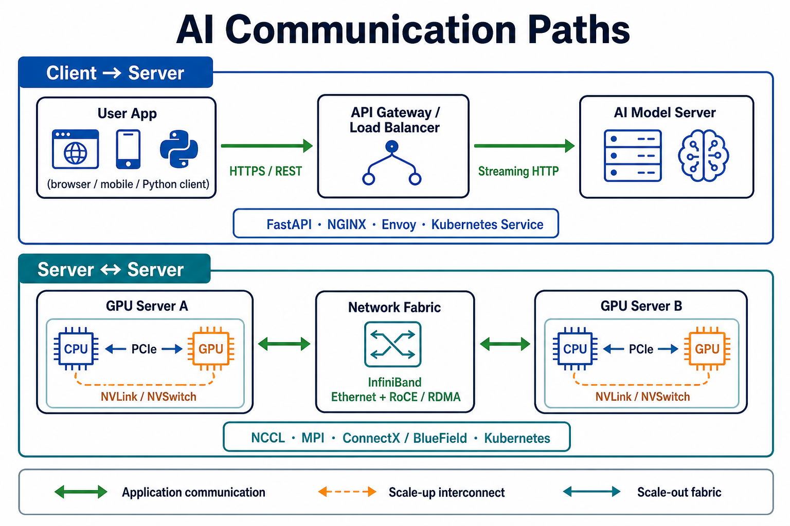

# Networking for AI

Networking connects AI users, applications, data stores, and compute systems. It determines how quickly a prompt reaches a model, how fast training workers exchange updates, and whether an AI service remains available as demand grows.

```text
User or application
        ↓ request
API gateway or load balancer
        ↓
AI application or model server
        ↓
Model, database, vector store, or other service
        ↓ response
User or application
```

## Why Networking Matters for AI

AI systems often run across more than one computer. A user may access a cloud-hosted model through an API; a retrieval-augmented generation system may call a vector database; and a large training job may coordinate many accelerators. Every request, response, data transfer, and synchronization step uses a network.

| Network property | Meaning | AI impact |
|---|---|---|
| **Latency** | Time for data to travel between systems. | Affects interactive chat, voice assistants, robotics, and every request in a multi-service pipeline. |
| **Bandwidth** | Amount of data that can move per second. | Affects model downloads, dataset transfers, distributed training, and streaming responses. |
| **Reliability** | Ability to deliver data correctly despite failures. | Prevents failed requests, interrupted training, and unavailable model services. |
| **Security** | Protection of data and communication. | Safeguards user prompts, model APIs, credentials, and proprietary datasets. |
| **Scalability** | Ability to handle more users or workers. | Lets an AI service distribute traffic across healthy model servers. |

## How AI Systems Communicate

Most AI applications use a client-server pattern. A client sends a request to a service, the service processes it or forwards it to a model, and the response returns over the network.

```text
Web page, mobile app, or another service
        ↓ HTTPS request
Application API
        ↓
Model inference service
        ↓
Generated result
```

Common communication methods include:

| Method | Typical use in AI | Example |
|---|---|---|
| **HTTPS / REST API** | Simple public or internal model APIs. | An application sends a prompt and receives a JSON response. |
| **Streaming HTTP** | Showing generated tokens as they become available. | A chatbot displays its answer gradually. |
| **gRPC** | Fast communication between internal services. | An application calls an embedding or ranking service. |
| **Message queue or event stream** | Work that can run asynchronously. | A document is placed in a queue for later embedding and indexing. |
| **Collective communication library** | Synchronizing distributed training workers. | GPUs exchange gradients during multi-node training. |

HTTPS is common at the public boundary because it works well with browsers and API clients. gRPC is often used inside a platform because it supports efficient remote procedure calls and bidirectional streaming over HTTP/2. During large distributed training, specialized collective communication libraries such as NCCL coordinate data exchange among GPUs.

## Communication Types and Enabling Tools

The diagram below separates the two main communication paths in an AI system: **client-to-server** traffic for using an AI application, and **server-to-server** traffic for running an AI platform or training cluster.



| Communication path | Type of communication | What it carries | Common tools or software |
|---|---|---|---|
| **Client → API gateway** | HTTPS / REST | Prompts, uploaded files, authentication, and JSON responses. | FastAPI, Flask, Django, Express, API gateways, NGINX, Envoy. |
| **Client ↔ model server** | Streaming HTTP, Server-Sent Events, or WebSocket | Generated tokens or other real-time updates. | FastAPI streaming, OpenAI-compatible servers, NGINX, Envoy, browser or mobile SDKs. |
| **Application ↔ internal AI service** | gRPC | Embedding, reranking, moderation, retrieval, or model-service calls. | gRPC, Protocol Buffers, Envoy, service mesh software. |
| **Application → background worker** | Message queue or event stream | Documents to ingest, batch jobs, evaluation tasks, and notifications. | Kafka, RabbitMQ, Redis, Celery, cloud queue services. |
| **GPU ↔ GPU in one server** | PCIe, NVLink/NVSwitch, or Infinity Fabric/xGMI | Model shards, activations, gradients, and peer-to-peer memory transfers. | CUDA, NCCL, ROCm, RCCL, NVIDIA Fabric Manager. |
| **GPU server ↔ GPU server** | InfiniBand or Ethernet with RoCE/RDMA | Distributed-training collectives, model-parallel traffic, checkpoints, and large datasets. | NCCL, MPI, UCX, RDMA drivers, NVIDIA ConnectX or BlueField software, Kubernetes Network Operator. |
| **Service ↔ service in a cluster** | TCP/IP, HTTP, gRPC, or service-mesh traffic | Requests among model servers, databases, vector stores, and observability systems. | Kubernetes Services and DNS, Istio, Linkerd, Envoy, CoreDNS. |

These tools work at different layers. For example, FastAPI creates an HTTP API, NGINX or Envoy can route and protect that API, Kubernetes can discover and load-balance services, and NCCL or RCCL coordinates high-speed GPU communication during distributed training.

## AI Interconnects: PCIe, NVLink, and RDMA

Not all AI communication crosses a conventional IP network. AI infrastructure also relies on **interconnects** that move data within a server or directly between servers. These links are essential because model parallelism, training synchronization, and GPU-to-GPU transfers can move far more data than a normal application request.

```text
Inside one server (scale up)
CPU ── PCIe ── GPU
               │
            NVLink / Infinity Fabric
               │
              GPU

Across servers (scale out)
GPU ── NIC ── InfiniBand or Ethernet with RoCE/RDMA ── NIC ── GPU
```

| Interconnect | Where it operates | How it helps AI |
|---|---|---|
| **PCI Express (PCIe)** | Inside a server, between the CPU, GPU, NIC, storage, and other devices. | Provides the general-purpose path used to attach accelerators and I/O devices. It is also the hardware foundation for technologies such as GPUDirect RDMA. |
| **NVLink and NVSwitch** | Primarily between NVIDIA GPUs in a server. | Provides high-bandwidth, low-latency GPU-to-GPU communication. NVSwitch expands this into a fabric so multiple GPUs can communicate at NVLink rates. |
| **AMD Infinity Fabric / xGMI** | Between supported AMD CPUs and GPUs or among AMD GPUs. | Provides a high-speed GPU-to-GPU scale-up interconnect for AI and HPC workloads. |
| **RDMA** | Between servers through an RDMA-capable network adapter. | Moves data directly between application memory without the CPU copying each transfer, reducing latency and CPU overhead. |
| **InfiniBand** | Dedicated high-performance cluster fabric. | Common for large AI and HPC clusters that require low-latency, high-throughput RDMA communication. |
| **RoCE** | RDMA over a lossless Ethernet network. | Brings RDMA-style transfers to Ethernet-based AI clusters. |

**Scale up** means connecting accelerators closely within a server. PCIe, NVLink, NVSwitch, and Infinity Fabric/xGMI are common scale-up technologies. **Scale out** means connecting multiple servers into a cluster; InfiniBand and Ethernet with RoCE are common scale-out choices.

RDMA is particularly useful for distributed AI. With ordinary networking, data may be copied through CPU-managed memory. RDMA lets a network adapter transfer data directly to or from application memory. NVIDIA GPUDirect RDMA can further create a direct path between GPU memory and a compatible network or storage device over PCIe, avoiding a CPU bounce buffer when the platform supports it.

## AI Networking Vendors and Ecosystems

AI networking is a system design rather than a single product. Accelerator vendors provide scale-up fabrics; networking vendors provide network adapters, switches, and software; and server vendors integrate them into AI clusters.

| Vendor or ecosystem | Relevant AI interconnect products or technologies | Typical role |
|---|---|---|
| **NVIDIA Networking** | NVLink, NVSwitch, ConnectX NICs and SuperNICs, BlueField DPUs, InfiniBand, RoCE, GPUDirect RDMA, NCCL. | Connects NVIDIA GPUs inside servers and across large AI clusters. NVIDIA documents ConnectX generations with InfiniBand or RoCE support from 200 Gb/s through 800 Gb/s, depending on product. |
| **AMD** | Infinity Fabric, xGMI, AMD Pensando networking, RCCL. | Provides GPU-to-GPU scale-up connectivity and Ethernet-based networking options for AMD AI platforms. |
| **Broadcom** | Ethernet switching silicon, network adapters, and PCIe connectivity products. | Supplies high-speed Ethernet and PCIe infrastructure used by many server and network-system vendors. |
| **Intel** | Ethernet adapters and switches, IPU/DPU technologies, and oneAPI communication software. | Supports Ethernet-based AI clusters and CPU, storage, and accelerator connectivity. |
| **Arista, Cisco, and other network-system vendors** | Data-center Ethernet switches, routing, telemetry, and network automation. | Build and operate the Ethernet fabrics that connect AI servers at cluster scale. |

When evaluating a vendor solution, compare the fabric type, link speed, latency, oversubscription, RDMA support, GPU/accelerator compatibility, software stack, cabling and power needs, and the topology supported by the server design. A fast NIC alone cannot make a fast AI cluster if the switches, links, topology, or collective-communication software are limiting performance.

## Latency and Bandwidth

Latency and bandwidth solve different problems:

```text
Low latency:     user prompt ── quickly reaches ── model server
High bandwidth:  large model or dataset ────────── quickly transfers
```

A voice assistant needs low latency so a reply feels natural. A team copying a large dataset to a training cluster needs high bandwidth. Distributed training needs both: workers must repeatedly exchange large gradient updates, and slow synchronization leaves expensive accelerators idle.

## Networking in Distributed AI

Large AI workloads are frequently divided across multiple computers or accelerators.

```text
Training worker 1 ─┐
Training worker 2 ─┼── exchange gradients ── shared model update
Training worker 3 ─┘
```

In **data-parallel training**, each worker processes a different batch of data and then exchanges gradient information so every worker keeps the same model. The communication can become the bottleneck when workers are spread across machines or data centers.

For inference, systems may distribute requests across multiple model servers:

```text
Users
  ↓
Load balancer
  ├── Model server A
  ├── Model server B
  └── Model server C
```

This improves availability and throughput. A load balancer can direct a request to a healthy server, while autoscaling can add or remove servers as demand changes.

## Data, Models, and Network Boundaries

Networking is also used to move AI assets:

| Asset | Typical path | Network concern |
|---|---|---|
| **Training data** | Storage → data-processing workers → training cluster | Large transfers and data access permissions. |
| **Model weights** | Model registry or storage → inference server | Startup time, version control, and transfer cost. |
| **Prompts and responses** | User → application → model API → user | Privacy, authentication, latency, and rate limits. |
| **Embeddings and retrieved documents** | Application ↔ vector database | Query latency and secure access to knowledge sources. |
| **Logs and metrics** | Services → observability platform | Volume, retention, and preventing sensitive-data leakage. |

## Common Networking Challenges for AI

| Challenge | Effect | Common response |
|---|---|---|
| **Slow client connection** | The user experiences delayed requests or streaming output. | Reduce response size, stream results, and use geographically closer services. |
| **Limited bandwidth** | Data, checkpoints, or gradients transfer slowly. | Use faster links, compress data where appropriate, and place compute near storage. |
| **High latency between services** | A multi-step AI workflow becomes slow. | Reduce unnecessary service calls, cache results, and colocate dependent services. |
| **Network failure** | Requests fail or training workers disconnect. | Use timeouts, retries, health checks, checkpoints, and redundant paths. |
| **Uneven traffic** | Some model servers are overloaded while others are idle. | Use load balancing, queues, and autoscaling. |
| **Insecure communication** | Prompts, data, or credentials may be exposed. | Use TLS, authentication, authorization, network segmentation, and secret management. |

## References

- [gRPC: About](https://grpc.io/about/) — official overview of gRPC, streaming, load balancing, tracing, and authentication.
- [gRPC: Introduction](https://grpc.io/docs/what-is-grpc/introduction/) — official introduction to remote procedure calls and Protocol Buffers.
- [NVIDIA NCCL Documentation](https://docs.nvidia.com/deeplearning/nccl/) — official documentation for GPU collective communication.
- [NVIDIA NVSwitch](https://docs.nvidia.com/ai-enterprise/release-8/latest/infra-software/vgpu/features/nvswitch.html) — official overview of NVLink-based multi-GPU fabric communication.
- [NVIDIA GPUDirect RDMA](https://docs.nvidia.com/cuda/gpudirect-rdma/) — official documentation for direct GPU-to-device data transfer over PCIe.
- [NVIDIA RDMA over Converged Ethernet (RoCE)](https://docs.nvidia.com/networking/display/mlnxenv581011/rdma%2Bover%2Bconverged%2Bethernet%2B%28roce%29) — official RDMA over Ethernet overview.
- [AMD xGMI configuration](https://instinct.docs.amd.com/projects/virt-drv/en/latest/userguides/XGMI_configuration.html) — official AMD explanation of its GPU-to-GPU interconnect based on Infinity Fabric.
- [NVIDIA network-platform support](https://docs.nvidia.com/networking/display/kubernetes2640/platform-support.html) — current ConnectX, BlueField, InfiniBand, RoCE, and port-speed examples.
- [Kubernetes Services, Load Balancing, and Networking](https://kubernetes.io/docs/concepts/services-networking/) — official explanation of service discovery, networking, and traffic management in Kubernetes.
