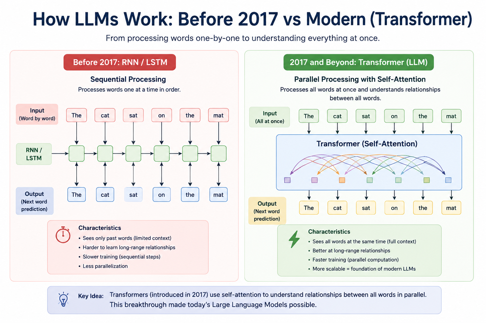

# Getting Started with an LLM

## Overview

Large Language Models (LLMs) have transformed how humans interact with computers. Instead of writing code or using complex interfaces, we can now communicate with machines using natural language.

Today, LLMs power chatbots, coding assistants, search engines, document analysis tools, AI agents, and many other intelligent applications.

An LLM is part of the broader field of **Natural Language Processing (NLP)**, which focuses on enabling computers to understand and generate human language. Before learning how to build LLM-powered applications, it is important to understand the fundamental concepts, the different types of models, and the ecosystem surrounding them.

This chapter provides that foundation.

---

# Roadmap

This chapter covers:

1. Natural Language Processing (NLP)
2. Evolution of Language Models
3. What is a Large Language Model?
4. Types of Language Models
5. Popular LLM Families
6. Foundation Models vs. LLMs
7. Open vs. Closed Models
8. The LLM Ecosystem
9. How an LLM Works
10. LLM Lifecycle
11. Talking to an LLM
12. Tokens and Context
13. Capabilities and Limitations
14. Summary

---

# 1. Natural Language Processing (NLP)

Natural Language Processing (NLP) is a branch of Artificial Intelligence (AI) that enables computers to understand, interpret, and generate human language.

For many years, NLP systems were built for specific tasks such as:

- Machine translation
- Sentiment analysis
- Text classification
- Search
- Chatbots
- Question answering
- Document summarization

The introduction of deep learning and the **Transformer** architecture revolutionized NLP, leading to today's Large Language Models.

---

# 2. Evolution of Language Models

Language models have evolved significantly over time.

```text
Rule-Based Systems
        ↓
Statistical Models
        ↓
Word Embeddings
        ↓
RNN / LSTM / GRU
        ↓
Transformer (2017)
        ↓
Foundation Models
        ↓
Large Language Models
```

Each generation improved the ability of computers to understand and generate natural language.

---

# 3. What is a Large Language Model?

A Large Language Model (LLM) is a deep learning model trained on massive amounts of text to understand and generate language.

Rather than storing facts like a database, an LLM predicts the most likely next **token** based on the context it receives.

The word **Large** refers to:

- Large datasets
- Large neural networks
- Billions (or trillions) of parameters
- Large-scale training infrastructure

Examples include GPT, Claude, Gemini, Llama, Mistral, and Qwen.

---

## 4. Types of Language Models

Modern Large Language Models (LLMs) are built using the **Transformer architecture**, introduced in the paper *Attention Is All You Need* (2017). The Transformer serves as the core neural network that enables models to understand context and generate text efficiently.



Depending on how the Transformer is designed, language models can be grouped into three main types:

- **Encoder models** focus on understanding and representing the input.
- **Decoder models** generate text one token at a time based on the input and previously generated tokens.
- **Encoder–Decoder models** first understand the input using an encoder and then generate an output using a decoder.

Each architecture is optimized for different natural language processing (NLP) tasks. Most modern conversational AI systems, including GPT, Llama, Mistral, Claude, and Gemini, are based on **decoder-only Transformers** because they are particularly effective at text generation.

| Model Type | Description | Examples | Best For |
|------------|-------------|----------|----------|
| **Encoder** | Reads and understands the input. Produces a representation (embedding) of the input but does not generate text. | BERT, RoBERTa | Classification, sentiment analysis, semantic search, embeddings |
| **Decoder** | Generates text one token at a time based on previously generated tokens. This is the architecture used by most modern LLMs. | GPT-5, GPT-4, Llama, Mistral | Chatbots, AI assistants, code generation, text generation |
| **Encoder–Decoder** | Uses an encoder to understand the input and a decoder to generate the output. | T5, BART, FLAN-T5 | Translation, summarization, question answering |

---

# 5. Popular LLM Families

Some of the most widely used LLM families include:

| Family | Organization |
|----------|--------------|
| GPT | OpenAI |
| Claude | Anthropic |
| Gemini | Google |
| Llama | Meta |
| Mistral | Mistral AI |
| Qwen | Alibaba |
| DeepSeek | DeepSeek AI |
| Gemma | Google |
| Phi | Microsoft |

---

# 6. Foundation Models vs. LLMs

A **Foundation Model** is a general-purpose AI model that can be adapted to many tasks.

Foundation Models can work with:

- Text
- Images
- Audio
- Video
- Multiple modalities

An **LLM** is a Foundation Model specialized for language understanding and generation.

---

# 7. Open vs. Closed Models

Today's models fall into two broad categories.

### Closed Models

- GPT
- Claude
- Gemini

Usually accessed through cloud APIs.

### Open Models

- Llama
- Mistral
- Gemma
- Qwen
- DeepSeek

Can often be downloaded and run locally.

---

# 8. The LLM Ecosystem

Working with LLMs involves much more than choosing a model.

### Model Providers

- OpenAI
- Anthropic
- Google
- xAI
- Cohere
- Mistral AI

### Model Hubs

- Hugging Face
- Ollama
- LM Studio

### Frameworks

- LangChain
- LlamaIndex
- Haystack
- DSPy

### Deployment

- Ollama
- llama.cpp
- vLLM

---

# 9. How an LLM Works

Every interaction follows a simple pipeline.

```text
Prompt
   ↓
Tokenizer
   ↓
Tokens
   ↓
Transformer
   ↓
Next Token Prediction
   ↓
Generated Response
```

The model repeatedly predicts one token at a time until the response is complete.

---

# 10. LLM Lifecycle

Modern LLMs go through several stages before reaching users.

```text
Data Collection
      ↓
Pretraining
      ↓
Instruction Tuning
      ↓
Alignment
      ↓
Evaluation
      ↓
Deployment
      ↓
Inference
```

Most developers only interact with the **Inference** stage.

---

# 11. Talking to an LLM

A conversation with an LLM typically consists of:

- System Prompt
- User Prompt
- Assistant Response
- Conversation History

Together, these provide the context that guides the model's responses.

---

# 12. Tokens and Context

LLMs process **tokens**, not words.

Important concepts include:

- Tokenization
- Input Tokens
- Output Tokens
- Context Window
- Token Limits

The larger the context window, the more information the model can consider in a single request.

---

# 13. Capabilities and Limitations

### Capabilities

- Answer questions
- Write code
- Summarize documents
- Translate languages
- Analyze information
- Generate content
- Assist with research
- Power AI agents

### Limitations

- Hallucinations
- Prompt sensitivity
- Context limits
- Bias
- Computational cost
- Privacy considerations

Understanding these limitations is essential when building reliable AI applications.

---

# Building Your First LLM Application

Before building an LLM-powered application, the first decision is **which language model to use**. In practice, there are two common approaches:

1. **Use a hosted LLM through an API**
2. **Use an open-weight pretrained model**

Both approaches use an **already trained model**. You are **not training the LLM from scratch**; instead, you are integrating an existing model into your application to perform inference.

---

# Option 1: Use a Hosted LLM

In this approach, the language model is hosted by a cloud provider. Your application sends a request to the provider's API, the model processes the prompt, and the generated response is returned to your application.

```text
Your Application
        │
        ▼
    LLM API
        │
        ▼
 Hosted LLM
        │
        ▼
    Response
```

Examples of hosted LLM providers include:

- OpenAI
- Anthropic
- Google Gemini
- Cohere

### Advantages

- No need to download or host the model.
- No GPU infrastructure required.
- Easy to get started.
- The provider manages scaling, updates, and maintenance.

### Disadvantages

- Requires an internet connection.
- API usage is typically billed.
- Less control over the underlying model.

### Example

```python
from openai import OpenAI

client = OpenAI()

response = client.responses.create(
    model="gpt-5",
    input="Explain self-attention in simple words."
)

print(response.output_text)
```

---

# Option 2: Use an Open-Weight Model

In this approach, you download a pretrained language model and run it on your own computer or server.

```text
Your Application
        │
        ▼
 Local Inference
        │
        ▼
Downloaded Model
        │
        ▼
    Response
```

Popular open-weight model families include:

- Llama
- Mistral
- Qwen
- Gemma
- Phi

These models can be downloaded from platforms such as **Hugging Face** and executed locally using libraries such as **Transformers**, **Ollama**, **llama.cpp**, or **vLLM**.

### Advantages

- Full control over the model.
- Can run without an internet connection.
- Better privacy since data stays on your infrastructure.
- Models can often be fine-tuned or customized.

### Disadvantages

- Requires local hardware (CPU or GPU).
- You are responsible for deployment and maintenance.
- Large models require significant memory and compute resources.

### Example

```python
from transformers import pipeline

generator = pipeline(
    task="text-generation",
    model="Qwen/Qwen2.5-0.5B-Instruct",
)

messages = [
    {
        "role": "user",
        "content": "Explain self-attention in simple words."
    }
]

response = generator(
    messages,
    max_new_tokens=100,
)

print(response[0]["generated_text"])
```

---

# Comparison

| Feature | Hosted LLM | Open-Weight Model |
|---------|------------|-------------------|
| Model Location | Cloud provider | Your computer or server |
| Internet Required | Yes | Not necessarily |
| GPU Required | No | Usually |
| Setup Complexity | Low | Medium to High |
| Infrastructure | Managed by the provider | Managed by you |
| Customization | Limited | High |
| Privacy | Data is sent to the provider | Data remains on your infrastructure |

---

# Which Approach Should You Choose?

If you are building your **first LLM application**, using a **hosted LLM** is usually the easiest and fastest approach. It allows you to focus on learning how to interact with the model without worrying about infrastructure.

If you need **greater control**, **offline execution**, **privacy**, or **model customization**, using an **open-weight model** is often the better choice.

---

# Summary

There are two primary ways to build an LLM-powered application:

- **Hosted LLM:** Access a model through an API managed by a cloud provider.
- **Open-Weight Model:** Download and run a pretrained model on your own infrastructure.

Both approaches allow you to leverage powerful language models without training them from scratch. The choice depends on your requirements for simplicity, cost, performance, privacy, and control.

---

# Next Step

Now that you understand the available approaches, the next step is to learn **how an application communicates with a Large Language Model by sending prompts and receiving generated responses.**

# Summary

Large Language Models are the latest generation of Natural Language Processing systems. They are built on Transformer architectures and trained on massive amounts of data to understand and generate human language.

Understanding the concepts introduced in this chapter—including NLP, language model types, popular LLM families, the LLM ecosystem, tokens, inference, and model limitations—provides the foundation for everything that follows.

In the next chapter, **Understanding LLM Requests**, we will explore what happens internally when you send a prompt to an LLM and how it generates a response.
